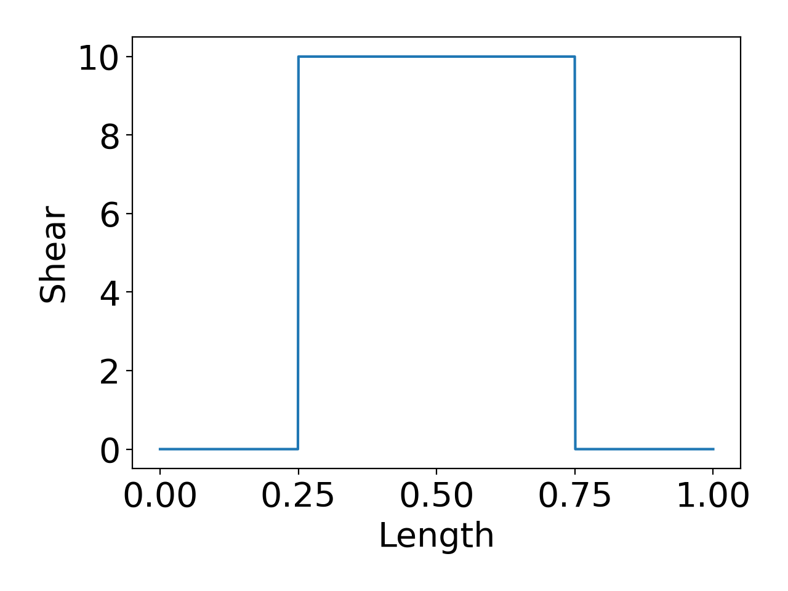
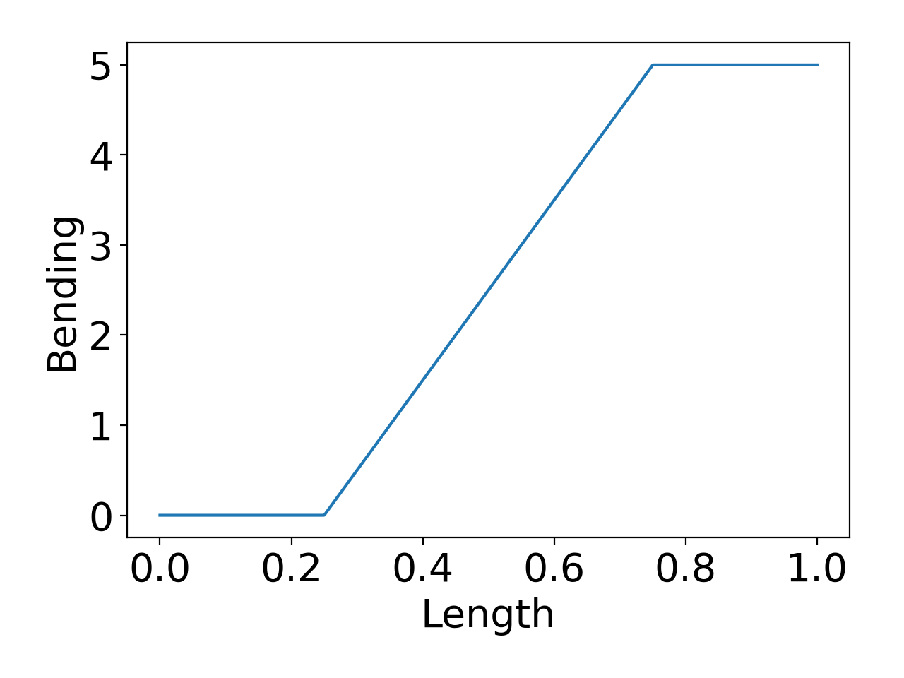

# Macaulay Notation in Python

A package to create, integrate and compute shear force and bending moments from [Macaulay Notation](https://en.wikipedia.org/wiki/Macaulay_brackets).

## Installing

From PyPi **[TODO]**

From Repo

```
pip install git+https://github.com/jamesgopsill/macaulay_py.git
```

## Usage

```python
from typing import List

from matplotlib import pyplot as plt

from macaulay import MacaulayBracket, compute, integrate

plt.rcParams.update({"font.size": 20, "figure.autolayout": True})

# Create your macaulay equation.
shear: List[MacaulayBracket] = [
    {"x": 0.25, "power": 0, "coefficient": 10},
    {"x": 0.75, "power": 0, "coefficient": -10},
]

# Compute the result
shear_res = compute(equation=shear)
print(shear_res)

plt.plot(shear_res[:, 0], shear_res[:, 1])
plt.xlabel("Length")
plt.ylabel("Shear")
plt.show()

# Integrate the equation.
bending = integrate(equation=shear)
# Remember: there may be some bending only contributions that you may need to add.
bending_res = compute(equation=bending)
print(bending_res)

plt.plot(bending_res[:, 0], bending_res[:, 1])
plt.xlabel("Length")
plt.ylabel("Bending")
plt.show()
```

And you should get some plots like this:




## Contributing

Clone the repository.

```
git clone https://github.com/jamesgopsill/macaulay_py.git
```

Create the environment.

```
python -m venv .venv
```

Activate the environment.

```
source .venv/bin/activate
```

Install the package in the environment.

```
pip install -e .
```